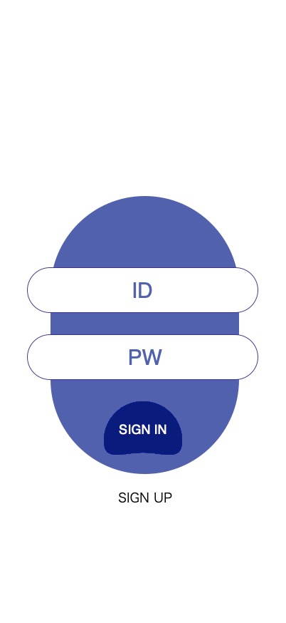
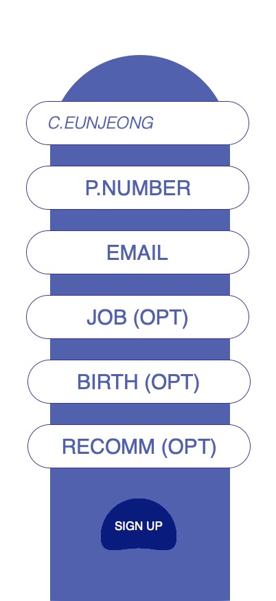
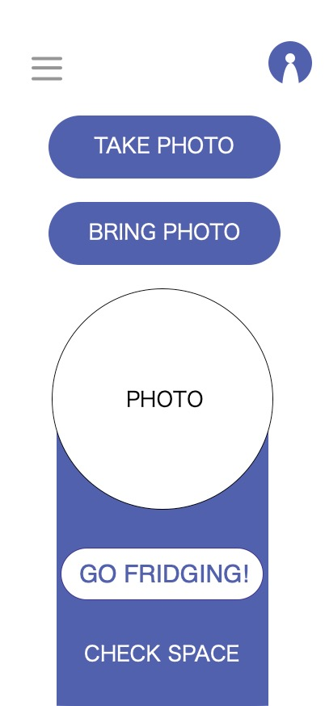
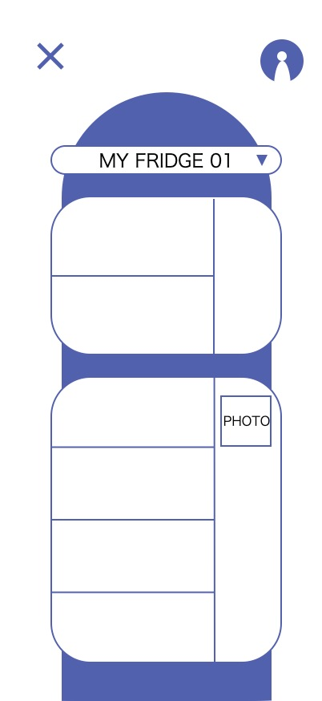
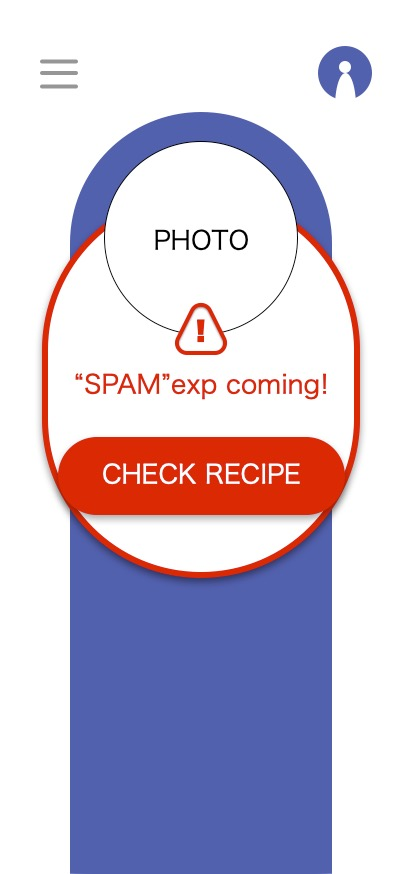
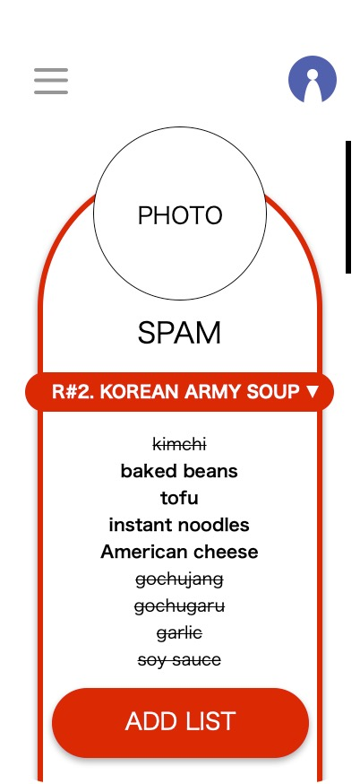
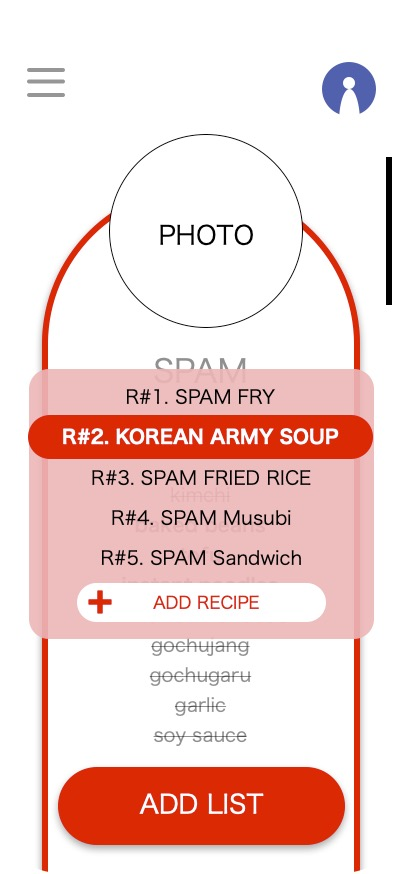
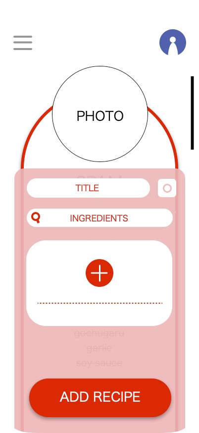

# Analysis.

### **Fridging**.

##### _냉장고 밖에서 관리하는 식품건강_

 

2213484 Choi Eunjeong

sspokopoko22@gmail.com

 
 
 

---

 

## **Revision history**

 

| Revision date | Version # | Description | Author |
| :-----------: | :-------: | :---------: | :----: |
|       .       |     .     |      .      |   .    |
|       .       |     .     |      .      |   .    |

 
 
 

---

 
 

# **Content**

 
 

 

#### 1. Introduction ..................................................................................

#### 2. Use case analysis .......................................................................

#### 3. Domain analysis ...........................................................................................

#### 4. User Interface Prototype ............................................................................

#### 5. Glossary .................................................................................................

#### 6. References .............................................................................................

 
 
 
 
 

---

 
 
 

### **1. Introduction**

 
하루에 보통 사람들은 3끼를 먹고, 그 식사를 개인의 일을 하면서 챙기는 건 어렵습니다. 
그래서 한끼를 거르거나, 간편하게 식사를 떼우다보니 건강을 걱정하거나 배달 소비가 잦아져서 걱정을 하는 분들이 많습니다. 
매끼식사를 고민하고 힘을쓰는 것에 피로감을 느껴 결국에는 배달음식을 시켜먹는 사람들, 또는 냉장고의 음식들의 유통기한을 확인하기 어려워서 
매번 정리를 하다가 유통기한을 넘긴 음식들을 확인하며 불쾌한 경험을 겪는 상황도 발생합니다.
그래서 냉장고에 있는 음식들의 소비기간을 알려주어 식사결정의 범주를 줄여주고, 보관중인 식재료를 활용한 레시피를 
제공하거나, 활용한 레시피를 만들때 어떤 재료를 쓸건지 위치를 알려주고 장볼때 겹치지않도록 리스트를 제공하여 
냉장고 안을 어디에 있던 파악해서 낭비를 줄이고, 보관중인 음식을 잘 활용할 수 있도록 하는 것에 초점을 두었습니다. 
 
 
 

---

 
 
 

### **2. Use Case Analysis**.

 

 
 
 

---

 
 
 

### **2-2. Use case description**.

 

#### 1. 회원가입

|| **Use case  #1 : 회원가입**  | 
| :-----------------------| :--------------------------------------------------------------------------------------------------------------------------------------------------------------------- |
||**GENERAL CHARACTERISTICS** |
| **Summary** | USER가 fridging을 사용하기위해 가입하기 위한 기능 |
| **Scope** | fridging                                                                                                                              |
| **Level**    | User Level                                                                                                             |
| **Author** | 최은정 |
| **Last Update** | 2026-05-08                                                                                                                             |
| **Status**    | Analysis                                                                                                             |
| **Primary Actor** | USER |
| **Precondition** | 휴대폰에 'fridging'앱이 깔려 있어야한다, 인터넷이 통하는 상태여야한다                                                                                                                           |
| **Trigger**    | fridging의 기능을 사용하려고 할때                                                                                                             |
| **Success Post Condition** | 사용자는 fridging에 로그인 할 수 있다 |
| **Failed Post Condition** | 사용자는 fridging에 로그인할 수 없다 |
|| **MAIN SUCCESS SCENARIO** |
| **Step** | Action |
| **S** | 이 use case는 사용자가 회원가입을 할때 시작된다. |
| **1** | user은 앱(시스템)을 실행한다. |
| **2** | user은 로그인 화면의 하단의 sign up버튼을 누른다.                                                                                                                           |
| **3** | 시스템은 회원가입을 위한 입력화면을 띄워준다.                                                                                                              |
| **4** | 입력된 칸에 정보를 기입한다. |
| **5** | user이 입력한 정보로 회원가입이 성공/실패했는지에대한 여부를 띄운다.                                                                                                                             |
| **6** | 이 use case는 사용자가 회원가입이 성공하면 끝난다.                                                                                                             |
|| **EXTENSION SCENARIOS** |
| **Step** | Branching Action |
| **4** | 4a) 사용자가 입력한 정보가 유효하지 않을 경우  4a1)'입력된 데이터가 유효하지않습니다'고 팝업을 띄움  4a2) 회원정보 입력단계로 돌아간다(Use Case #1-3)   4b) 사용자가 입력창을 다 채우지 않은 상태에서, 회원가입 완료버튼을 누른 경우  4a1)'회원정보가 다 입력되지 않았습니다'고 팝업을 띄움  4a2) 회원정보 입력단계로 돌아간다(Use Case #1-3)|             
|| **RELATED INFORMATION** |
|**Performance**| <= 2 seconds|
|**Frequency**| 1 times per user |
|**Concurrency**| None |
|**Due Date**| 2026_05_08 |

 

#### 2. 로그인

|| **Use case  #2 : 로그인**  | 
| :-----------------------| :-------------------------------------------------------------------------------------- |
||**GENERAL CHARACTERISTICS** |
| **Summary** | USER가 fridging을 사용하기위해 가입여부를 확인하기 위한 기능 |
| **Scope** | fridging                                                                                                                              |
| **Level**    | User Level                                                                                                             |
| **Author** | 최은정 |
| **Last Update** | 2026-05-08                                                                                                                             |
| **Status**    | Analysis                                                                                                             |
| **Primary Actor** | USER |
| **Precondition** | 휴대폰에 'fridging'앱이 깔려 있어야한다, 해당 앱에 가입이 되어있는 상태여야 한다                                                            |
| **Trigger**    | fridging의 기능을 사용하려고 할때                                                                                                             |
| **Success Post Condition** | 사용자는 fridging에 사용허가를 받고, 메인화면으로 이동한다 |
| **Failed Post Condition** | 사용자는 fridging에 사용허가를 받지못하고, 회원가입기능만 사용할 수 있다 |
|| **MAIN SUCCESS SCENARIO** |
| **Step** | Action |
| **S** | 이 use case는 사용자가 로그인을 할때 시작된다. |
| **1** | user은 앱(시스템)을 실행한다. |
| **2** | user가 ID와 PASSWORD를 입력한 뒤, 로그인 버튼을 누른다.                                                                                                                             |
| **3** | 시스템이 입력된 ID PASSWORD를 바탕으로 DB에서 등록된 회원인지 확인한다                                                                                                             |
| **4** | 이 use case는 사용자가 로그인이 성공하면 끝난다.                                                                                                             |
|| **EXTENSION SCENARIOS** |
| **Step** | Branching Action |
| **3** | 3a)아이디나 비밀번호가 잘못 입력되었을 경우 3a1)로그인버튼 위에 빨간글씨로 "잘못된 ID또는 PASSWORD입니다."라고 띄움 3a2)로그인 창에서 새로 입력한다(Use Case #2-2)                                                |
|| **RELATED INFORMATION** |
|**Performance**| <= 2 seconds|
|**Frequency**| 1 times per user |
|**Concurrency**| None |
|**Due Date**| 2026_05_08 |
 

#### 3. 음식 입력

|| **Use case  #3 : 음식 입력**  | 
| :-----------------------| :--------------------------------------------------------------------------------------------------------------------------------------------------------------------- |
||**GENERAL CHARACTERISTICS** |
| **Summary** | USER가 음식을 fridging에 등록하기 위한 과정 |
| **Scope** | fridging                                                                                                                              |
| **Level**    | User Level                                                                                                             |
| **Author** | 최은정 |
| **Last Update** | 2026-05-08                                                                                                                             |
| **Status**    | Analysis                                                                                                             |
| **Primary Actor** | USER |
| **Precondition** | 휴대폰에 'fridging'앱이 깔려 있어야한다, 로그인이 완료된 상태여야한다, 입력할 음식을 가지고 있어야한다.                                                   |
| **Trigger**    | fridging에 냉장고에 새로 보관할 음식정보를 추가할때                                                                                                             |
| **Success Post Condition** | User은 fridging에 새로운 음식정보를 추가하고, 식품위치 입력창이 나온다 |
| **Failed Post Condition** | 식품을 시스템에 새로 입력 할 수 없다. |
|| **MAIN SUCCESS SCENARIO** |
| **Step** | Action |
| **S** | 이 use case는 사용자가 제품등록을 할때 시작된다. |
| **1** | user은 로그인을 한다. |
| **2** | 메인화면에서 음식등록 버튼을 누른다.                                                                                                                           |
| **3** | user은 사진으로 검색/이름으로 검색중에서 고른다.                          |
| **4** | 유통기한을 기입하고 등록한다. |
| **5** | 이 use case는 식품위치 입력창이 나오면 끝난다.                                                                                                             |
|| **EXTENSION SCENARIOS** |
| **Step** | Branching Action |
| **3** | 3a) user가 사진으로 입력시, 음식이 아닌 다른 것을 찍었을 경  3a1)'확인할 수 없습니다'고 팝업을 띄움  3a2) 다시 제품등록을 결정하는 화면을 띄운다(Use Case #3-3)   3b) 사용자가 이름으로 입력하기를 골랐을때, 입력하지않고 확인을 누른 경우  3b1)버튼이 비활성화된 상태로 하단에'아직 이름이 입력되지않았습니다'글을 띄움  3b2) 회원정보 입력단계로 돌아간다(Use Case #3-3)|             
|| **RELATED INFORMATION** |
|**Performance**| <= 5 seconds|
|**Frequency**| 15 times per user |
|**Concurrency**| None |
|**Due Date**| 2026_05_08 |
 

#### 4. 유통기한 경고

|| **Use case  #4 : 유통기한 경고**  | 
| :-----------------------| :--------------------------------------------------------------------------------------------------------------------------------------------------------------------- |
||**GENERAL CHARACTERISTICS** |
| **Summary** | USER가 fridging를 사용할 때, 유통기한이 임박한 음식을 알리는 기능 |
| **Scope** | fridging                                                                                                                              |
| **Level**    | User Level                                                                                                             |
| **Author** | 최은정 |
| **Last Update** | 2026-05-08                                                                                                                             |
| **Status**    | Analysis                                                                                                             |
| **Primary Actor** | USER |
| **Precondition** | 'fridging'앱에 로그인이 되어있어야 한다, 제품입력을 해둔 상태여야한다                                                                                                                          |
| **Trigger**    | 입력했던 음식의 유통기한이 임박해갈때                                                                                                             |
| **Success Post Condition** | USER는 제품의 유통기한이 임박하기 7일전에 알림을 받을수 있다 |
| **Failed Post Condition** | USER는 제품의 유통기한이 임박하기 7일전에 알림을 받을수 없다 |
|| **MAIN SUCCESS SCENARIO** |
| **Step** | Action |
| **S** | 이 use case는 사용자가 음식등록을 끝낸 뒤에 입력했던 유통기한이 임박하면 시작된다. |
| **1** | user은 앱(시스템)을 실행한다. |
| **2** | 시스템은 유통기한이 7일남은 음식에대한 유통기한 경고 팝업을 띄운다.                                                                         |
| **3** | 하단의 레시피 확인하기 버튼을 누른다. |
| **4** | 이 use case는 사용자가 해당 음식에 대한 레시피를 확인하면 끝난다.                                                                                                             |
|| **EXTENSION SCENARIOS** |
| **Step** | Branching Action |
| **4** | 3a) 레시피확인버튼이 아닌 외부화면을 클릭할 경우  3a1)3회정도 유통기한 경고 팝업을 띄운다  3a2) 레시피를 확인하는 버튼을 누르면 레시피를 보여주는 화면을 띄운다(Use Case #4-4)|             
|| **RELATED INFORMATION** |
|**Performance**| <= 2 seconds|
|**Frequency**| 3 times per user |
|**Concurrency**| None |
|**Due Date**| 2026_05_08 |
 

#### 5. 식품 위치 입력

|| **Use case  #5 : 식품 위치 입력**  | 
| :-----------------------| :--------------------------------------------------------------------------------------------------------------------------------------------------------------------- |
||**GENERAL CHARACTERISTICS** |
| **Summary** | USER가 등록한 음식을 냉장고에 배치할 위치를 저장하기위한 기능 |
| **Scope** | fridging                                                                                                                              |
| **Level**    | User Level                                                                                                             |
| **Author** | 최은정 |
| **Last Update** | 2026-05-08                                                                                                                             |
| **Status**    | Analysis                                                                                                             |
| **Primary Actor** | USER |
| **Precondition** | 휴대폰에 'fridging'앱이 깔려 있어야한다, 로그인이 되어있는 상태여야한다, 제품입력을 해둔 상태여야한다                                                                                                                            |
| **Trigger**    | fridging의 음식을 입력하고 제품을 놓은 위치를 기록할때                                                                                                            |
| **Success Post Condition** | USER가 등록한 음식의 위치정보다 포함된 냉장고의 위치맵이 나온다.|
| **Failed Post Condition** | USER가 등록한 음식의 위치정보다 포함된 냉장고의 위치맵이 나오지 않는다. |
|| **MAIN SUCCESS SCENARIO** |
| **Step** | Action |
| **S** | 이 use case는 USER가 음식등록을 한 후에 시작된다. |
| **1** | user은 음식을 앞서 등록을 한다. |
| **2** | user은 냉장고 축소맵위에 둘 위치를 정한 뒤 넣어둔다.                                                                                                                           |
| **3** | user은 냉장고 축소맵위에 음식이미지를 스크롤해서 원하는 위치에 둔다.                                                                                                              |
| **4** | 확인버튼을 눌러서 위치편집을 종료한다. |
| **5** | 이 use case는 사용자가 배치해둔 음식의 위치가 제대로 뜨면 끝난다.                                                                                                             |
|| **EXTENSION SCENARIOS** |
| **Step** | Branching Action |
| **2** | 2a) 냉장고의 자리가 거의 꽉차있어서 못정한 경우  2a1)'위치가 정해지지않았습니다'고 팝업을 띄우고 '넘어가기'와 '설정하기'중 고르기  2a2) 넘어가기를 고를경우 메인화면이, 설정하기를 고를 경우 음식이미지 위치를 정하는 화면을 띄운다(Use Case #5-3)   |             
|| **RELATED INFORMATION** |
|**Performance**| <= 2 seconds|
|**Frequency**| 3 times per user |
|**Concurrency**| None |
|**Due Date**| 2026_05_08 |
 

#### 6. 장보기 리스트 추천

|| **Use case  #6 : 장보기 리스트 추천**  | 
| :-----------------------| :--------------------------------------------------------------------------------------------------------------------------------------------------------------------- |
||**GENERAL CHARACTERISTICS** |
| **Summary** | 사용자가 레시피에 따라 요리를 할때, 필요한 재료 구매를 위한 기능 |
| **Scope** | fridging                                                                                                                              |
| **Level**    | User Level                                                                                                             |
| **Author** | 최은정 |
| **Last Update** | 2026-05-08                                                                                                                             |
| **Status**    | Analysis                                                                                                             |
| **Primary Actor** | USER |
| **Precondition** | 휴대폰에 'fridging'앱이 깔려 있어야한다, 음식정보가 미리 입력되어 있어야한다                                                                                                                          |
| **Trigger**    | 레시피를 따를때, 필요한 재료중 소유하고 있는 것과 아닌것을 구분해야 할때                                                                                                             |
| **Success Post Condition** | 사용자는 입력한 음식정보를 바탕으로, 가지고 있지않은 재료의 리스트만 볼 수 있다 |
| **Failed Post Condition** | 사용자는 레시피에 필요한 재료 리스트에서 가지고 있는것과 아닌것을 분리안된 리스트만 볼 수 있다. |
|| **MAIN SUCCESS SCENARIO** |
| **Step** | Action |
| **S** | 이 use case는 사용자가 레시피를 볼때 시작된다. |
| **1** | user은 유통기한 임박팝업에서 레시피확인 버튼을 실행한다. |
| **2** | user은 원하는 음식 레시피를 결정해 누른다.                                                                                                                           |
| **3** | 이 use case는 사용자가 선택한 레시피 하단에 음식재료가 뜨면 끝난다.                                                                                                             |
|| **EXTENSION SCENARIOS** |
| **Step** | Branching Action |
| **1** | 1a) 레시피가 등록되어 있지 않은경우  1a1)'해당 음식에 대한 레시피가 없습니다'고 팝업을 띄움  1a2) 전에 보던 페이지로 돌아간다|             
|| **RELATED INFORMATION** |
|**Performance**| <= 2 seconds|
|**Frequency**| 1 times per user |
|**Concurrency**| None |
|**Due Date**| 2026_05_08 |
 

#### 7. 레시피 추천

|| **Use case  #7 : 레시피 추천**  | 
| :-----------------------| :--------------------------------------------------------------------------------------------------------------------------------------------------------------------- |
||**GENERAL CHARACTERISTICS** |
| **Summary** | 사용자가 음식을 소비하기위해 레시피 추천을 받는 기능 |
| **Scope** | fridging                                                                                                                              |
| **Level**    | User Level                                                                                                             |
| **Author** | 최은정 |
| **Last Update** | 2026-05-08                                                                                                                             |
| **Status**    | Analysis                                                                                                             |
| **Primary Actor** | USER |
| **Precondition** | 휴대폰에 'fridging'앱이 깔려 있어야한다, 음식정보가 입력되어있는 상태여야한다                                                                                                                           |
| **Trigger**    | USER이 레시피 추천기능을 사용하려고 할때                                                                                                             |
| **Success Post Condition** | 사용자는 선택한 음식에대한 추천레시피를 확인할 수 있다 |
| **Failed Post Condition** | 사용자는 선택한 음식에대한 추천레시피를 확인할 수 없다 |
|| **MAIN SUCCESS SCENARIO** |
| **Step** | Action |
| **S** | 이 use case는 사용자가 레시피추천기능을 클릭 할때 시작된다. |
| **1** | user은 냉장고 축소 이미지위에 배치된 음식이미지 중 조회하고 싶은 음식을 누른다. |
| **2** | 시스템은 해당 음식에 대한 레시피를 고를 수 있게 띄운다.                                                                                                                           |
| **3** | user은 원하는 레시피 이름을 누른다.                                                                                                              |
| **4** | 이 use case는 사용자가 원하는 레시피정보가 뜨면 끝난다.                                                                                                             |
|| **EXTENSION SCENARIOS** |
| **Step** | Branching Action |
| **2** | 2a) 음식에 대한 레시피가 없을 경우  2a1)'해당 음식에 대한 레시피가 없습니다'고 팝업을 띄움  2a2) 전에 보던 페이지로 돌아간다|
|| **RELATED INFORMATION** |
|**Performance**| <= 2 seconds|
|**Frequency**| 1 times per user |
|**Concurrency**| None |
|**Due Date**| 2026_05_08 |
 

#### 8. 신규 레시피 등록

|| **Use case  #8 : 신규레시피등록**  | 
| :-----------------------| :--------------------------------------------------------------------------------------------------------------------------------------------------------------------- |
||**GENERAL CHARACTERISTICS** |
| **Summary** | 사용자가 fridging에 소지하고 있는 재료에 대해 레시피를 추가하기위한 기능 |
| **Scope** | fridging                                                                                                                              |
| **Level**    | User Level                                                                                                             |
| **Author** | 최은정 |
| **Last Update** | 2026-05-08                                                                                                                             |
| **Status**    | Analysis                                                                                                             |
| **Primary Actor** | USER, Administer |
| **Precondition** | 휴대폰에 'fridging'앱이 깔려 있어야한다, 음식정보가 입력되어 있는 상태여야한다                                                                                                                          |
| **Trigger**    | fridging의 기능을 사용하려고 할때                                                                                                             |
| **Success Post Condition** | 시스템은 레시피 추가를 위한 화면을 띄운다 |
| **Failed Post Condition** | 사용자는 fridging에 새로운 레시피를 추가할 수 없다 |
|| **MAIN SUCCESS SCENARIO** |
| **Step** | Action |
| **S** | 이 use case는 사용자가 레시피를 보고있을때 시작된다. |
| **1** | user은 레시피 리스트 하단의 +버튼을 누른다. |
| **2** | 레시피의 이름과 재료를 검색해서 저장한다.                                                                                                                           |
| **3** | 하단의 +를 눌러서 요리방법을 추가해간다.                                                                                                              |
| **4** | 다 적었다면 하단의 'add recipe'버튼을 클릭한다 |
| **5** | 이 use case는 레시피 목록에 사용자가 추가한 레시피가 뜨면 끝난다.                                                                                                             |
|| **EXTENSION SCENARIOS** |
| **Step** | Branching Action |
| **2** | 2a) 입력하려는 재료가 뜨지 않을경우  4a1)'직접입력'버튼을 눌러 입력한다|             
|| **RELATED INFORMATION** |
|**Performance**| <= 2 seconds|
|**Frequency**| 1 times per user |
|**Concurrency**| None |
|**Due Date**| 2026_05_08 |
 

 
 
 

### **3. Domain Analysis**.

 

#### (1) User: 사용자 클래스
여기서는 일반 사용자 외에도 관리자도 사용자에 포함되어 일반화 가능하다

#### (2) Admin: 관리자 클래스
관리자 클래스이다. 여기서는 사용자의 정보를 관리하고 레시피를 수정/삭제하는 관리가 가능하다

#### (3) Food: 음식 클래스
사용자가 추가한 음식의 클래스. 유통기한과, 관련된 레시피를 연결하고 음식재료와 연동이 된다.

#### (4) Position:음식 위치 클래스
음식별로 저장된 위치를 저장하기위한 클래스.

   
   
   

### 4. User Interface Prototype

 

 
 
 

### **6. Glossary**.

 

|    Terms    |                                        Description                                        |
| :---------: | :---------------------------------------------------------------------------------------: |
|   사용자    |                  앱을 사용하며 데이터를 입력하고 사용하는 사람을 가리킴                   |
|   관리자    | 새로운 레시피를 추가 등록하고, 사용자가 입력한 문제를 고쳐 앱의 관리를 맡은 사람을 가리킴 |
|   DB서버    |                 사용자와 관리자가 입력한 정보들은 저장하는 서버를 가리킴                  |
|  소비기한   |            겉에 표시된 보관 방법을 따를 경우 안전하게 섭취할 수 있는 최종 기한            |
| 로그인 정보 |                                      아이디+비밀번호                                      |

 
 
 

---

 
 
 

### **7. References**

 

[1] [데일리팝](http://www.dailypop.kr "솔로이코노미_냉장고엔 3일치만 남는다...804만 1인가구가 바꾼 식품시장 판도")

[2] [와이스앱](<https://www.wiseapp.co.kr/insight/detail/872/delivery-app-mau-rankings-2025#:~:text=Table_title:%20%ED%95%9C%EA%B5%AD%EC%9D%B8%EC%9D%B4%20%EA%B0%80%EC%9E%A5%20%EB%A7%8E%EC%9D%B4%20%EC%82%AC%EC%9A%A9%ED%95%98%EB%8A%94%20%EB%B0%B0%EB%8B%AC%20%EC%95%B1,%ED%99%9C%EC%84%B1%20%EC%82%AC%EC%9A%A9%EC%9E%90%20%EC%88%98(MAU):%20345%EB%A7%8C%20%EB%AA%85(%EC%97%AD%EB%8C%80%20%EC%B5%9C%EB%8C%80!)%20%7C> "쿠팡이츠∙땡겨요∙먹깨비 앱 사용자 역대 최대...배달앱 순위는?")

 
 
 

---

